# Test

Descripción de como crear tests unitarios en Go. 

Para el ejemplo, usaremos un programa que calcula, dado un entero, la cantidad de pasos y la serie de números generadas al aplicar las operaciones definidas en la Conjetura de Collatz

>__Conjetura de Collatz__
>
>Sea la siguiente operación, aplicable a cualquier número entero positivo:
>
>- Si el número es par, se divide entre 2.
>- Si el número es impar, se multiplica por 3 y se suma 1.
>
>Ahora, se forma una sucesión mediante la aplicación de esta operación repetidamente, comenzando por cualquier entero positivo, y tomando el resultado de cada paso como la entrada del siguiente.
>
>La conjetura indica que siempre alcanzaremos el 1 independientemente del número con el que comencemos.

## Creando un test

1. Creamos el archivo test

Creamos un archivo llamado `nombre`_test.go, donde `nombre` es el nombre del archivo donde se encuentra la función que queremos testear:

> Para nuestro caso vamos a testear las funciones del archivo `collatz.go`, por lo que creamos el archivo `collatz_test.go`

El `_test` al final del nombre es lo que utiliza Go para identificar los archivos de testeo. El archivo test debe encontrarse en la misma carpeta que el archivo a testear, por lo que, va a pertenecer al mismo paquete

2. Definimos la función de testeo.

Definimos las funciones `func Test_`_nombre_`(t *testing.T)` donde _nombre_ es el nombre de la función que vamos a testear. Dentro de esta función generamos los casos de prueba y los mensajes de error:

```go
import "testing"

func Test_esPar(t *testing.T) {

	casos := []struct {
		entrada int
		salida  bool
	}{
        // casos a probar: entrada y salida esperada
		{entrada: 2, salida: true},
		{entrada: 9, salida: false},
		{entrada: 3, salida: false},
	}

	for _, caso := range casos {
		if resultdado := esPar(caso.entrada); resultdado != caso.salida {
            
            // Mensaje en caso de que haya un error
			t.Errorf("Error: para %d, se esperaba \"%t\" pero se obtuvo \"%t\"", caso.entrada, caso.salida, resultdado)
		}
	}
}
```

3. Corremos los tests 

Corremos los test, parándonos en la carpeta donde se encuentra el archivo, con `go test -v` (el `-v` es para que detalle de la corrida, en caso de no colocarlo se mostrara solo si paso o no de forma total)

-Test OK con y sin `-v`:

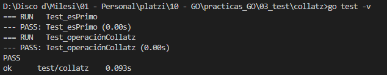
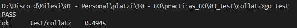


-Test FAIL con y sin `-v`:

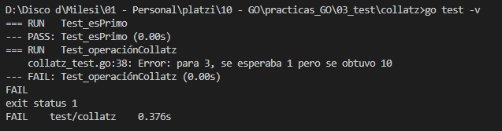
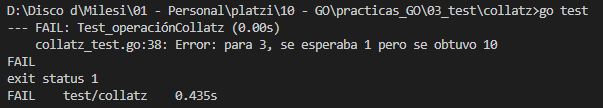


## Mocks

Los mocks (objetos simulados) son objetos que imitan el comportamiento de objetos reales de una forma controlada. Se usan para probar a otros objetos en pruebas unitarias que esperan mensajes de una clase en particular para sus métodos.

Cuando testeamos una función, solo queremos probar la funcionalidad de esa función pero hay funciones que utilizan otras o que realizan consultas a bases de datos, por lo que, al ejecutar el test estamos ejecutando estos pasos intermedios que, quizás, no nos interesa realizar para el fin del test. Ademas de que genera mayor tiempo de testeo y complejidad para detectar errores.

Los objetos simulados se usan para simular el comportamiento de objetos complejos cuando es imposible o impracticable usar al objeto real en la prueba. De paso resuelve el problema del caso de objetos interdependientes, que para probar el primero debe ser usado un objeto no probado aún, lo que invalida la prueba.

Para nuestro ejemplo, la función `operaciónCollatz` utiliza la función `esPar`, por lo que, al realizar el test de la primera, indirectamente también esto realizando el de la segunda. En caso de un error, seria mas complejo saber si el error es de una u de otra. Ademas, si hacer la comprobación de `esPar` lleva mucho tiempo, el test de `operaciónCollatz` consumiría mucho tiempo también, y seria debido a algo que no es su funcionalidad principal

Es aca donde se implementa un objeto mock, que simula ser `esPar` y le entrega una respuesta a `operaciónCollatz` para que pueda realizar su función. De esta forma, no consumo el tiempo que me ocupa realizar `esPar` y en caso de un error, se que se encuentra en la lógica de `operaciónCollatz`

### Implementarlo

- 1 Transformamos las funciones que queremos mockear en variables: 

```go
// la función original
func esPar(numero int) bool {
	return numero%2 == 0
}

// la transformamos en variable
var esPar = func(numero int) bool {
	return numero%2 == 0
}
```

- 2 Generamos la funcion de testeo

- 2.1 Generamos los casos de testeo con la función mockeada:

```go
casos := []struct {
		entrada  int
		salida   int
		mockFunc func()
	}{
		{entrada: 2, salida: 1, mockFunc: func() {
			esPar = func(int) bool { return false }

			// si hubiera otra función la cargo aca esPar2 = func(){....}
		},
		},
		{entrada: 8, salida: 4, mockFunc: func() {
			esPar = func(int) bool { return false }
		},
		},
	}
```
- 2.2 Guardamos la función original (la necesitaremos para el paso 2.4)

```go
originalEsPar := esPar 
```

- 2.3 Mockeamos la función

```go
for _, caso := range casos {

		caso.mockFunc() // aca realizo el mockeo de la función

		if resultdado := operaciónCollatz(caso.entrada); resultdado != caso.salida {
			t.Errorf("Error: para %d, se esperaba %d pero se obtuvo %d", caso.entrada, caso.salida, resultdado)
		}
	}
```

- 2.4 Devolvemos a la función mockeada la funcion original

```go
esPar = originalEsPar 
```

Esto ultimo es, para que los siguientes test que se realicen en la corrida, no queden con la función moqueada y se genere un comportamiento no esperado

Para nuestro caso, al correr el test obtendremos:

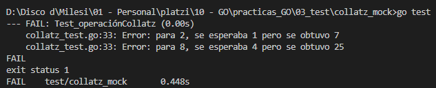

Podemos ver que figuran dos error, esto es debido a que forzamos a que la función `esPar` devuelva false (numero impar) aun cuando la entrada era par

El problema que veo con esta metodología es el tener que modificar el código para transformar las funciones a mockear a variables


## Code coverage

Conocer que parte del código esta cubierto con el test y cual no. Su utilización en GO es muy sencilla solo se ejecuta el comando `go test -cover` y tendremos como respuesta el porcentaje de código que esta cubierto con test:

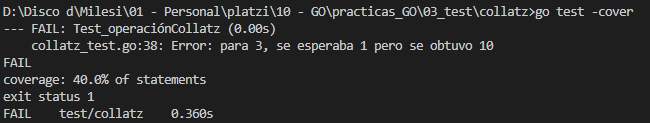

Ahora conocemos el porcentaje de código cubierto con test. Pero no conocemos cuales son las partes que están cubiertas y cuales no.

Si ejecutamos `go test -coverprofile=coverage.out` generara el archivo `coverage.out`, dentro de la misma carpeta, con el detalle de lo corrido:

```
test/collatz/collatz.go:5.29,7.2 1 1
test/collatz/collatz.go:9.40,11.19 1 1
test/collatz/collatz.go:11.19,14.3 1 1
test/collatz/collatz.go:14.8,16.3 1 1
test/collatz/collatz.go:19.74,23.19 2 0
test/collatz/collatz.go:23.19,27.3 3 0
test/collatz/collatz.go:29.2,29.8 1 0
```

El detalle es de difícil interpretación. Para tener las métricas legibles del resultado del coverage usamos `$ go tool cover -func=coverage.out` que utilizara el archivo `coverage.out` generado para dar mas detalle de código cubierto con test.

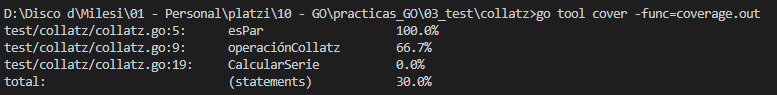

Con esto podemos ver, que archivos y funciones fueron testeadas y su porcentaje de cobertura. Si quisiéramos algo aun mas detallado, usamos `go tool cover -html=coverage.out` esto nos abrirá el navegador:

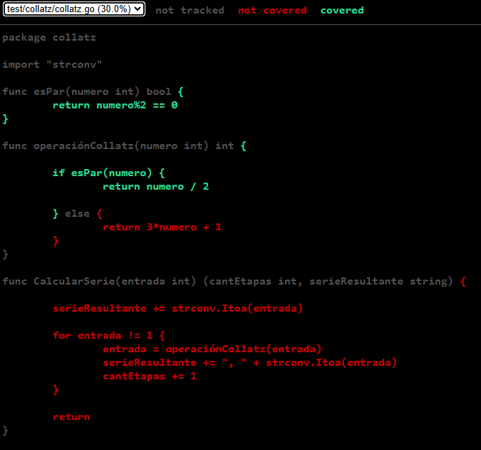

En donde veremos el código y marcado con color verde que parte esta cubierta por un test y con rojo que parte no lo esta.

> Observe, para la función `operaciónCollatz` los casos solo testea el return si es par (el else nunca lo testea), por ello se marca en rojo y el porcentaje de 66.7%

## Profiling
Consiste en revisar el código para encontrar las funciones criticas, las cuales, consumen mucha CPU. Lo que se busca es encontrar en que puntos del código enfocarnos a la hora de realizar una mejora.

> Para probar esta funcionalidad creamos la función que calcula numero de Fibonacci

Para ver el uso de CPU del código que testeamos, usamos `go test -cpuprofile=cpu.out`, se generara un archivo `cpu.out` donde se guardara el análisis. Para ver el resumen del uso del CPU usamos `go tool pprof cpu.out`:

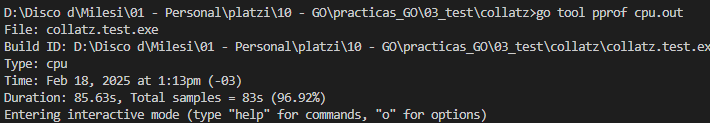

Vemos que tardo 85 segundos en realizar los test. Si al ejecutar (pprof) top se muestra: _Showing nodes accounting for 0, 0% of 0 total flat flat% sum% cum cum%_ Significa que la función se ejecuta con una carga muy baja para la cpu

Dentro de pprof podremos ingresar comandos. Ingresando el comando `top` podemos ver como se han comportado los programas en nuestro test:

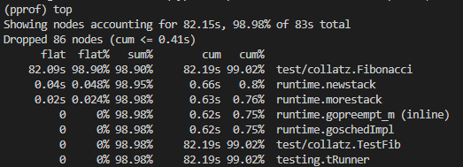

> Para nuestro ejemplo la función Fibonacci consumió el 99% del tiempo del test

Podemos inspeccionar el tiempo promedio de ejecución de cada línea de una función, usando el comando __list <nombre_funcion>__, para nuestro ejemplo `list Fibonacci`:

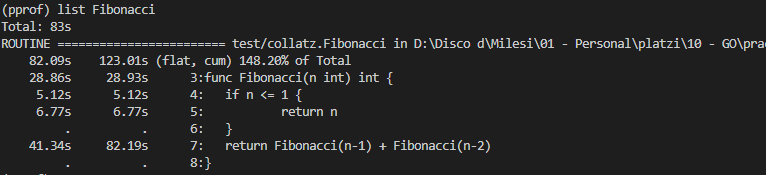

> Es en el return donde la función consume mas tiempo

También podemos ver el reporte del promedio de ejecución:

- en el navegador, usando `web`
- exportarlo en pdf, usando `pdf`

<sub> (Para que ambos comandos funcionen requieren tener graphviz instalado)</sub>

Para salir de (pprof) puedes usar `quit` o `q`
