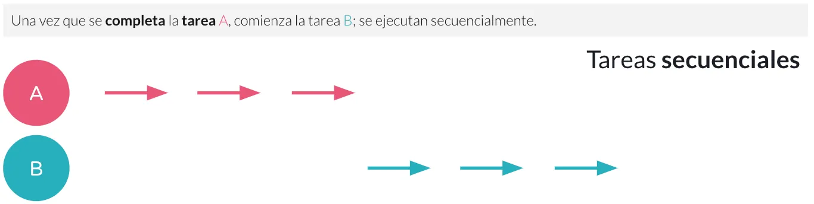
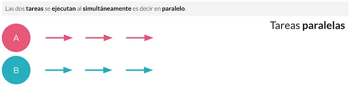
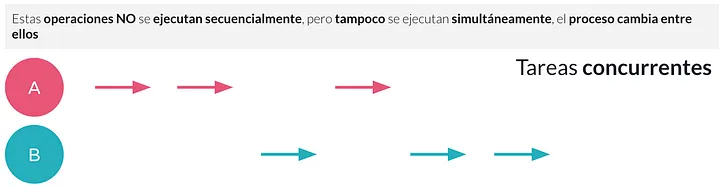

# Concurrencia

GO utiliza concurrencia para ejecutar multiples tareas. Para comprender que es la concurrencia explicaremos que es secuencial, concurrente y paralela:

- Secuencial: Ejecutar una tarea, donde una vez terminada se ejecuta la siguiente.



Es decir, termina de ejecutar todos los paso de la tarea A para comenzar con la B

- Paralelismo: Ejecutar varias tareas simultáneamente o dicho de otra manera hacer muchas cosas al mismo tiempo.



Ahora las tareas se ejecutan en simultanea, los pasos de la tarea A y B se ejecutan al mismo tiempo, no importa si comenzo o termino la otra tarea.

- Concurrencia: Ejecutar varias tareas mediante periodos de tiempo supuestos y no uno tras otro o dicho de otra manera es tratar con muchas cosas al mismo tiempo



En otras palabras, no espera a terminar todas los pasos de la tarea A para comenzar con la tarea B, sino que, si encuentra una ventana de tiempo entre los pasos de la tarea A comienza con los pasos de la tarea B y alterna entre una y otra según la disponibilidad.

Puede darnos la ilusión de paralelismo, ya que ambos procesos o tareas hacen un progreso CASI idénticos , aunque en realidad solo ocurre UNA tarea en un momento dado.

## Goroutine

La concurrencia es manejada en Go mediante las goroutines (hilo ligero de ejecución). Para lanzar una goroutine anteponemos la palabra `go` al momento de lanzar la función:

```go
func main(){
    go tarea1()
    go tarea2()
    go tarea3()
}
```
De esta manera, el main (posee su propia Goroutine), la tarea1, tarea2 y tarea3 se ejecutan en su propia Goroutine.

Ya que el main es nuestro hilo principal, al finalizar, finaliza también el programa. En el ejemplo anterior, luego de lanzar las goroutine el programa finalizará sin esperar que finalicen las tarea1, tarea2 o tarea3, ya que no hay nada que impida o que deje esperando a que las goroutine lanzadas finalicen.

Una forma de realizar esta espera es mediante WaitGroup

### WaitGroup 

Un WaitGroup es simplemente un contador que me permite llevar la cuenta de cuantas Goroutine hay activas y esperar a que finalicen. Si tenemos lo siguiente:

```go
for i := 0; i < 10; i++ {
    go func() {
        fmt.Println(i)
    }()
}
```

Veremos no se imprime nada, ya que no hay nada que espere la finalización de las goroutine, para ello uso un WaitGroup como contador

```go
// creamos el contador
var wg sync.WaitGroup

for i := 0; i < 10; i++ {

    // sumamos 1 antes de tirar la goroutine
    wg.Add(1)

    go func() {
        //resta 1 
        defer wg.Done() // el "defer" es para asegurar que sea lo ultimo que se ejecute
        fmt.Println(i)
    }()
}

// bloqueamos hasta que el contador sea 0
wg.Wait()
```
Ahora veremos que se imprimen los números del 0 al 9, debido a que, con `wg.Add(1)`, `wg.Done()` y `wg.Wait()` contamos cuantas goroutine lanzamos, cuando termino su ejecución y bloqueamos esperando a que terminen todas

> <sub>
> Vemos que la salida es desordenada, esto es debido a la concurrencia que ejecuta las tareas según la disponibilidad
> </sub>

Otra forma de esperar a la ejecución de las goroutine, aunque poseen otros usos mas interesantes, es mediante el uso de Channels

## Channels 

Los channels son como tuberías que conectan las goroutine entre sí. Puedes enviar datos a través de un channel y recibirlos en otro. Y lo mejor de todo es que los channels son seguros para la concurrencia, por lo que no tienes que preocuparte por los problemas de sincronización.

Para crear un channel utilizamos la función `make` e indicamos el tipo de dato que pasara por él. Por ejemplo: `c := make(chan int)` creamos el canal `c` por el que puede pasar datos tipo `int`.

Para indicar cuando se coloca y se saca un dato del canal, se utiliza el operador `<-`: 
- `c <- 4` : indica que se envía el valor 4 por el canal
- `<- c`: indica que se extrae el valor del canal

En el ejemplo `ejemplo.CreandoChannel()`:

```go
c := make(chan int)

go func(ch chan int, numero int) {

    ch <- numero
    fmt.Println("Numero Colocado")

}(c, 10)

fmt.Print(<-c)
```

En la función anónima, que se ejecuta en una goroutine independiente, se envía el valor al canal (`ch <- numero`) que es tomado por la goroutine main e impreso (`fmt.Print(<-c)`) 

#### Bloqueo del channel

En el ejemplo anterior podemos observar que el programa no finaliza luego de lanzar la goroutine, sino que la espera. Esto ocurre, debido a que las goroutine, cuando intentan lanzar o tomar un dato de un canal, quedan bloqueada hasta que puedan realizarlo. 

En el ejemplo, la goroutine main quedo bloqueada en `fmt.Print(<-c)` esperando que otra goroutine lanzara un dato. Cuando lo lanzo, tanto la goroutine main como la goroutine que lanzo el dato, pueden continuar con la ejecución

Una goroutine se puede bloquea esperando recibir un dato como también, esperando para enviarlo. Si queremos enviar un dato pero no hay nada para recibirlo, la goroutine quedar bloqueada, si vemos el ejemplo `ejemplo.BloqueoChannelConSleep()`:

```go
c := make(chan int)

go func(ch chan int, numero int) {

    ch <- numero
    fmt.Println("Numero Colocado")

}(c, 10)

time.Sleep(3 * time.Second)
fmt.Print("hola")
```
Lo que se imprimirá sera `hola` pero no `Numero colocada` debido que la goroutine se bloquea en `ch <- numero` al querer lanzar un dato pero no hay otra goroutine para tomarlo.

Esto si no se maneja con cuidado puede producir deadlock. En el ejemplo `ejemplo.BloqueoChannelConOtroChannel()`:

```go
dato := make(chan int)
finTarea := make(chan bool)

go func(c_dato chan int, c_finTarea chan bool, numero int) {

    c_dato <- numero
    fmt.Println("Numero Colocado")
    c_finTarea <- true

}(dato, finTarea, 10)

<-finTarea
fmt.Print(<-dato)
```
Tenemos dos canales: el canal `dato` por donde se envía el numero y el canal `finTarea` usado como bandera para saber cuando finalizo la goroutine. El ejemplo produce un error tipo deadlock, ya que, la goroutine main queda bloqueada a la espera de recibir algo por `finTarea` pero la goroutine de la función anónima esta bloqueada a la espera de querer enviar algo por `dato`, una bloquea a la otra.

Otra forma de generar un deadlock es querer sacar un algo de un canal que ya se le ha extraido el dato. Si al ejemplo `ejemplo.CreandoChannel()` le coloco otro `fmt.Print(<-c)` al final:

```go
c := make(chan int)

go func(ch chan int, numero int) {

    ch <- numero
    fmt.Println("Numero Colocado")

}(c, 10)

fmt.Print(<-c)
fmt.Print(<-c)
```

Produzco un deadlock, ya que el segundo print queda esperando un dato que ya fue extraído, pero la razón es la misma que ya comentamos, la goroutine main queda bloqueada en el segundo print a la espera que le envíen algo por el canal, como no hay otra goroutine que lo envié, se produce el deadlock.

Lo mismo ocurriría si realizo un doble envío pero solo lo puedo tomar una vez, en el `ejemplo.DeadlockPorDobleenvio()` se puede comprobar:

```go
c := make(chan int)

go func(ch chan int) {

    fmt.Println(<-ch)

}(c)

c <- 10
c <- 10

time.Sleep(100 * time.Millisecond) //solo para darle tiempo a que se ejecute la goroutine
```

## Unbuffered channels y buffered channels